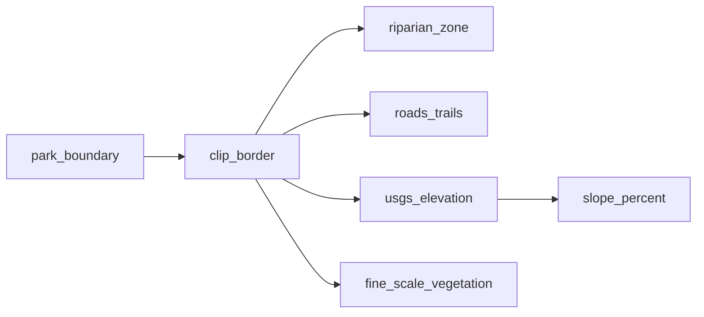

# Goats

<!-- auto:begin -->
## Layers

### Staging Areas

**Source:** `output/staging.shp`  
**Style:** single symbol — SVG marker goat.svg, 6.0 MM  

### Park Boundary

**Source:** `data/park_boundary.geojson`  
**Style:** single symbol — fill #000000 at 0% opacity, #808080 outline  

### Clip Border (100 ft buffer)

**Source:** `output/border.gpkg`  
**Style:** single symbol — fill #000000 at 0% opacity, #6464c8 outline  
**Derived from:** `park_boundary`  

### Developed Area

**Source:** `output/developed_area.shp`  
**Style:** single symbol — fill #c8c8c8 at 50% opacity, #808080 outline  

### Riparian Areas

**Source:** `output/water.shp`  
**Style:** single symbol — solid line #4477aa, 0.6 MM  
**Derived from:** `clip_border`  

### Roads & Trails

**Source:** `output/roads_trails.shp`  
**Style:** single symbol — solid line #785028, 0.5 MM  
**Derived from:** `clip_border`  

### Slope

**Source:** `output/slope.tif`  
**Style:** paletted raster (4 classes)  
**Derived from:** `usgs_elevation`  

### Elevation

**Source:** `output/elevation.tif`  
**Style:** no style configured  
**Derived from:** `clip_border`  

### Fine-Scale Vegetation (2020)

**Source:** `output/vegetation.gpkg`  
**Style:** rule-based (7 rules)  
**Derived from:** `clip_border`  

### CartoDB Positron

**Source:** `CartoDB Positron XYZ tile service`  
**Style:** see `styles/cartodb_positron.xml`  

## Data flow

<!-- auto:end -->
