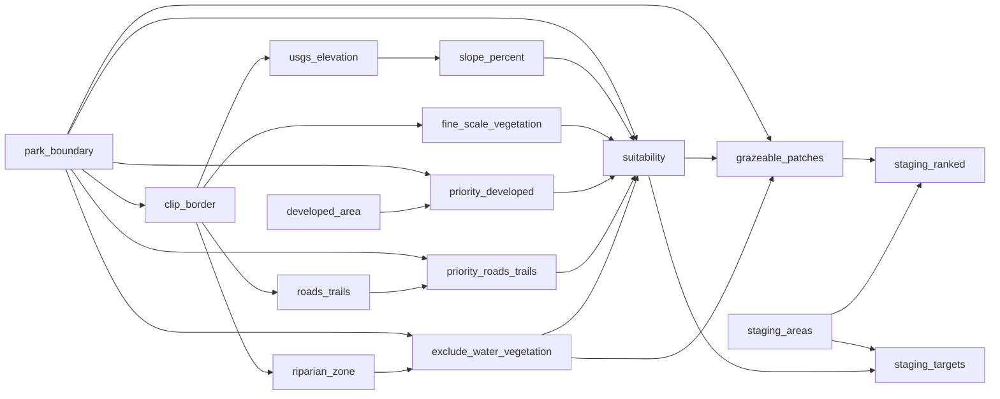

# Goats

<!-- auto:begin -->
## Layers

### Staging Area Ranking

**Source:** `output/staging_ranked.gpkg`  
**Style:** rule-based (3 rules)  
**Derived from:** `grazeable_patches`, `staging_areas`  

### Staging Areas

**Source:** `output/staging.shp`  
**Style:** single symbol — circle marker #a01e1e, 3.0 MM  

### Park Boundary

**Source:** `data/park_boundary.geojson`  
**Style:** single symbol — fill #000000 at 0% opacity, #808080 outline  

### Clip Border (100 ft buffer)

**Source:** `output/border.gpkg`  
**Style:** single symbol — fill #000000 at 0% opacity, #6464c8 outline  
**Derived from:** `park_boundary`  

### Staging Area Scores

**Source:** `output/staging_scored.gpkg`  
**Style:** rule-based (3 rules)  
**Derived from:** `staging_areas`, `suitability`  

### Grazeable Patches

**Source:** `output/patches.gpkg`  
**Style:** rule-based (4 rules)  
**Derived from:** `park_boundary`, `suitability`, `exclude_water_vegetation`  

### Exclusion: Riparian Buffer

**Source:** `output/exclude_water_vegetation.gpkg`  
**Style:** single symbol — fill #4477aa at 50% opacity, #285078 outline  
**Derived from:** `park_boundary`, `riparian_zone`  

### Priority: Roads & Trails Buffer

**Source:** `output/priority_roads_trails.gpkg`  
**Style:** single symbol — fill #ffc800 at 50% opacity, #b48c00 outline  
**Derived from:** `park_boundary`, `roads_trails`  

### Priority: Developed Area Buffer

**Source:** `output/priority_developed.gpkg`  
**Style:** single symbol — fill #ff8c00 at 50% opacity, #c86400 outline  
**Derived from:** `park_boundary`, `developed_area`  

### Developed Area

**Source:** `output/developed_area.shp`  
**Style:** single symbol — fill #c8c8c8 at 50% opacity, #808080 outline  

### Riparian Areas

**Source:** `output/water.shp`  
**Style:** single symbol — solid line #4477aa, 0.6 MM  
**Derived from:** `clip_border`  

### Roads & Trails

**Source:** `output/roads_trails.shp`  
**Style:** single symbol — solid line #785028, 0.5 MM  
**Derived from:** `clip_border`  

### Slope

**Source:** `output/slope.tif`  
**Style:** paletted raster (4 classes)  
**Derived from:** `usgs_elevation`  

### Elevation

**Source:** `output/elevation.tif`  
**Style:** no style configured  
**Derived from:** `clip_border`  

### Fine-Scale Vegetation (2020)

**Source:** `output/vegetation.gpkg`  
**Style:** rule-based (7 rules)  
**Derived from:** `clip_border`  

### Suitability

**Source:** `output/suitability.tif`  
**Style:** paletted raster (4 classes)  
**Derived from:** `park_boundary`, `slope_percent`, `fine_scale_vegetation`, `priority_developed`, `priority_roads_trails`, `exclude_water_vegetation`  

### CartoDB Positron

**Source:** `CartoDB Positron XYZ tile service`  
**Style:** see `styles/cartodb_positron.xml`  

## Data flow

<!-- auto:end -->
