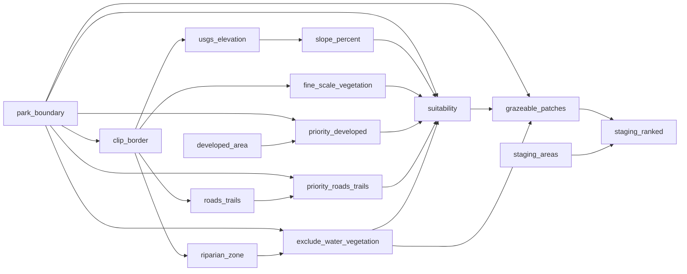

# Goats

Habitat suitability analysis for goat grazing at Alum Rock Park. Identifies grazeable patches from terrain, vegetation, and proximity data; ranks staging areas by distance-weighted access to high-priority grazing terrain.

[Illustrated analysis](https://github.com/kielni/alidade/blob/main/projects/goats/story/README.md)

CRS: EPSG:26910 (NAD83 / UTM Zone 10N)

<!-- auto:begin -->
## Data Sources

| File | Description | Origin |
|---|---|---|
| `data/staging.geojson` | Candidate goat staging area points | Field-recorded |
| `data/park_boundary.geojson` | Park boundary polygon | OpenStreetMap via Overpass Turbo |
| `data/Alum_Rock_developed_area.gpx` | GPS tracks of developed area perimeter | Strava walk |
| `data/water.geojson` | Waterway stream lines | OpenStreetMap via Overpass Turbo |
| `data/roads_trails.geojson` | Road and trail lines | OpenStreetMap via Overpass Turbo |
| `data/USGS_bbox.tif` | 1/3 arc-second elevation DEM | USGS National Elevation Dataset, EPSG:4269 |
| `data/fine_scale_vegetation_bbox.gpkg` | 121-class NVC vegetation map, 2020; 309,785 polygons county-wide, 343 within park | Santa Cruz / Santa Clara County, EPSG:6420 |
| `CartoDB Positron XYZ tile service` | CartoDB Positron | XYZ / WMS tile service |

## Processing Steps

1. **Staging Areas** — Reproject staging area points to project CRS
2. **Developed Area** — Convert GPX to GeoPackage for developed area layer
3. **Clip Border (100 ft buffer)** — Buffer park boundary by 100 ft (30.48 m) to create clip border
4. **Priority: Developed Area Buffer** — Buffer developed area by 100 ft and clip to park boundary
5. **Riparian Areas** — Reproject and clip streams to park boundary
6. **Roads & Trails** — Reproject and clip roads and trails to park boundary
7. **Elevation** — Reproject DEM from EPSG:4269 to EPSG:26910 and crop to park boundary
8. **Fine-Scale Vegetation (2020)** — Reproject, clip, and dissolve fine-scale vegetation by lifeform category
9. **Exclusion: Riparian Buffer** — Buffer streams by 100 ft and clip to park boundary
10. **Priority: Roads & Trails Buffer** — Buffer roads and trails by 30 ft and clip to park boundary
11. **Slope** — Compute percentage slope from elevation DEM and classify into 4 categories
12. **Suitability** — Weighted overlay: slope + vegetation + priority buffers → suitability raster
13. **Target Grazing Zones** — Vectorize suitability raster into scored grazeable patches
14. **Staging Area Ranking** — Score each staging point by distance-decay sum over grazeable patches

## Data Flow

<!-- auto:end -->
