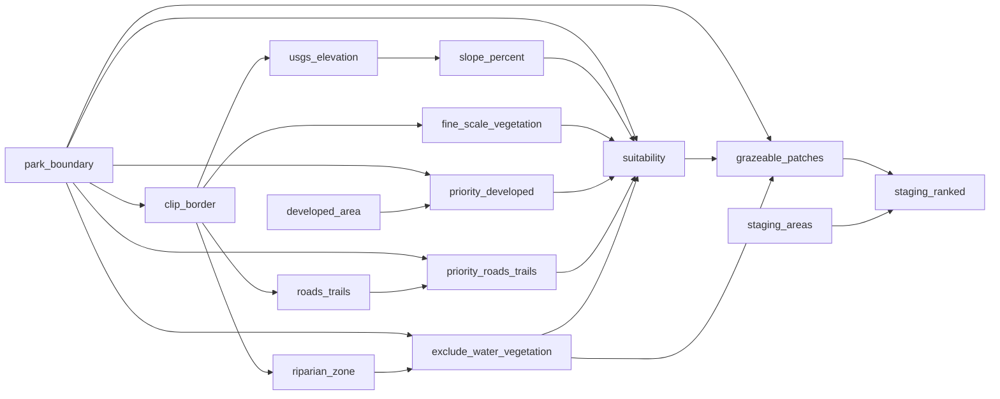

# Goats

Habitat suitability analysis for goat grazing at Alum Rock Park. Identifies grazeable patches from terrain, vegetation, and proximity data; ranks staging areas by distance-weighted access to high-priority grazing terrain.

CRS: EPSG:26910 (NAD83 / UTM Zone 10N)

<!-- auto:begin -->
## Data Sources

| File | Description | Origin |
|---|---|---|
| `data/park_boundary.geojson` | Park boundary polygon | OpenStreetMap via Overpass Turbo |
| `data/water.geojson` | Waterway stream lines (36 features) | OpenStreetMap via Overpass Turbo |
| `data/roads_trails.geojson` | Road and trail lines (1,537 features) | OpenStreetMap via Overpass Turbo |
| `data/fine_scale_vegetation.gdb` | 121-class NVC vegetation map, 2020; 309,785 polygons county-wide, 343 within park | Santa Cruz / Santa Clara County, EPSG:6420 |
| `data/USGS_13_n38w122_20250826.tif` | 1/3 arc-second elevation DEM | USGS National Elevation Dataset, EPSG:4269 |
| `data/Alum_Rock_developed_area.gpx` | GPS tracks of developed area perimeter | Field-recorded |
| `data/staging.geojson` | Candidate goat staging area points | Field-recorded |

## Processing Steps

1. **Clip border** — 100 ft buffer around park boundary; dissolve to single polygon; used as clip mask for all raster and vector inputs
2. **Developed area** — Merge GPX tracks → simplify 10 m → close ring → polygon, reprojected to EPSG:26910
3. **Elevation** — DEM reprojected EPSG:4269 → EPSG:26910, cropped to clip border (bilinear resampling)
4. **Streams / Roads & Trails** — Reproject + clip to clip border; roads filter out polygons
5. **Fine-scale vegetation** — Reproject EPSG:6420 → EPSG:26910, clip to clip border, dissolve by `ENHANCED_LIFEFORM`; 7 suitability zones
6. **Slope** — `gdaldem slope -p` on elevation; reclassified to 4 byte classes at 15 / 27 / 58% breaks
7. **Priority buffers** — Buffer developed area 100 ft and roads/trails 30 ft; union; clip to park boundary
8. **Riparian exclusion** — Buffer streams 30 ft; union; clip to park boundary
9. **Suitability raster** — Weighted overlay: slope 25% + vegetation 25% + developed buffer 25% + roads/trails buffer 25%; riparian and too-steep (class 4) pixels zeroed out; Jenks 4-class on non-zero pixels; clipped to park boundary
10. **Grazeable patches** — Vectorize non-zero suitability pixels → morphological closing (+10 m / −10 m) → Voronoi-split patches > 120,000 m² → subtract riparian exclusion → drop fragments < 500 m²; scored by suitability_sum / perimeter
11. **Staging area ranking** — Distance-decay score Σ(patch_score / distance) over High and Very high patches only; distance clamped ≥ 50 m; rank 1 = best access

## Data Flow

<!-- auto:end -->
