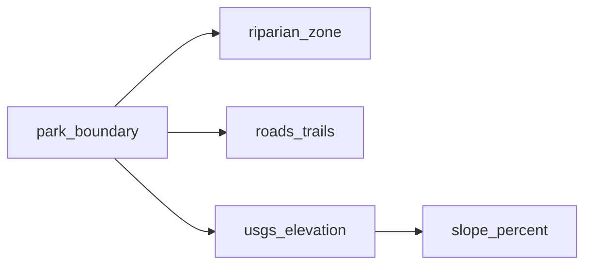

# Goats

<!-- auto:begin -->
## Layers

### Staging Areas

**Source:** `output/staging.shp`  
**Style:** single symbol — SVG marker goat.svg, 6.0 MM  
**Processing:** Reproject staging area points to EPSG:26910

### Park Boundary

**Source:** `data/park_boundary.geojson`  
**Style:** single symbol — fill #000000 at 0% opacity, #800080 outline  

### Developed Area

**Source:** `output/developed_area.shp`  
**Style:** single symbol — fill #c8c8c8 at 50% opacity, #808080 outline  
**Processing:** Simplify GPX track (10 m tolerance), close ring, convert to polygon, reproject to EPSG:26910

### Riparian Areas

**Source:** `output/water.shp`  
**Style:** single symbol — solid line #4477aa, 0.6 MM  
**Derived from:** `park_boundary`  
**Processing:** Reproject and clip streams to park boundary

### Roads & Trails

**Source:** `output/roads_trails.shp`  
**Style:** single symbol — solid line #785028, 0.5 MM  
**Derived from:** `park_boundary`  
**Processing:** Reproject and clip roads and trails to park boundary

### Slope

**Source:** `output/slope.tif`  
**Style:** paletted raster (4 classes)  
**Derived from:** `usgs_elevation`  
**Processing:** Compute percentage slope from elevation DEM and classify into 4 categories

### Elevation

**Source:** `output/elevation.tif`  
**Style:** no style configured  
**Derived from:** `park_boundary`  
**Processing:** Reproject DEM from EPSG:4269 to EPSG:26910 and crop to park boundary

### CartoDB Positron

**Source:** `CartoDB Positron XYZ tile service`  
**Style:** see `styles/cartodb_positron.xml`  

## Data flow

## Processing tools

| Layer | Tool | Description |
| --- | --- | --- |
| `staging_areas` | `geopandas` | Reproject staging area points to EPSG:26910 |
| `developed_area` | `geopandas` | Simplify GPX track (10 m tolerance), close ring, convert to polygon, reproject to EPSG:26910 |
| `riparian_zone` | `geopandas` | Reproject and clip streams to park boundary |
| `roads_trails` | `geopandas` | Reproject and clip roads and trails to park boundary |
| `slope_percent` | `gdaldem` (subprocess) | Compute percentage slope from elevation DEM and classify into 4 categories |
| `usgs_elevation` | `gdalwarp` (subprocess) | Reproject DEM from EPSG:4269 to EPSG:26910 and crop to park boundary |
<!-- auto:end -->
