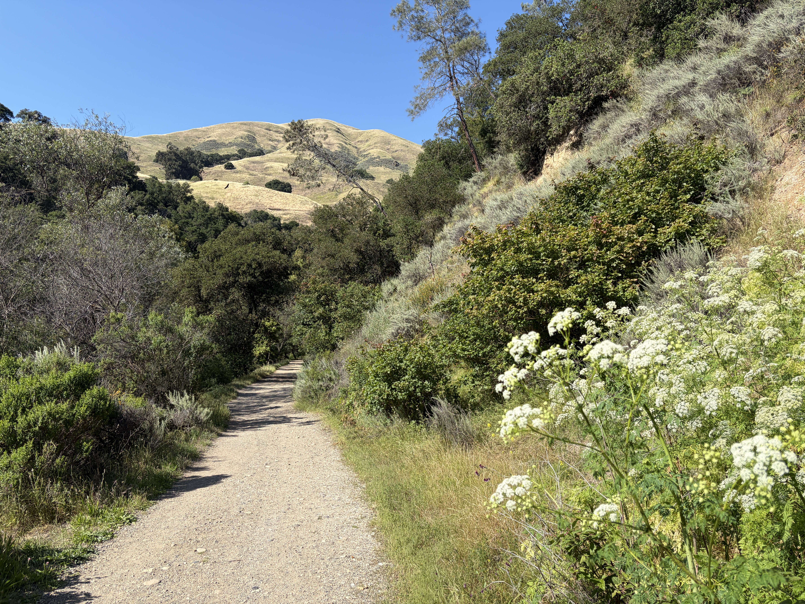
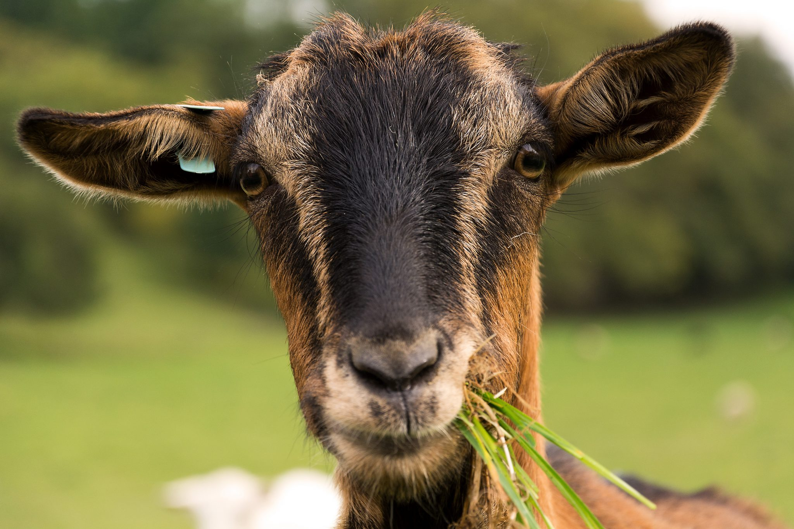
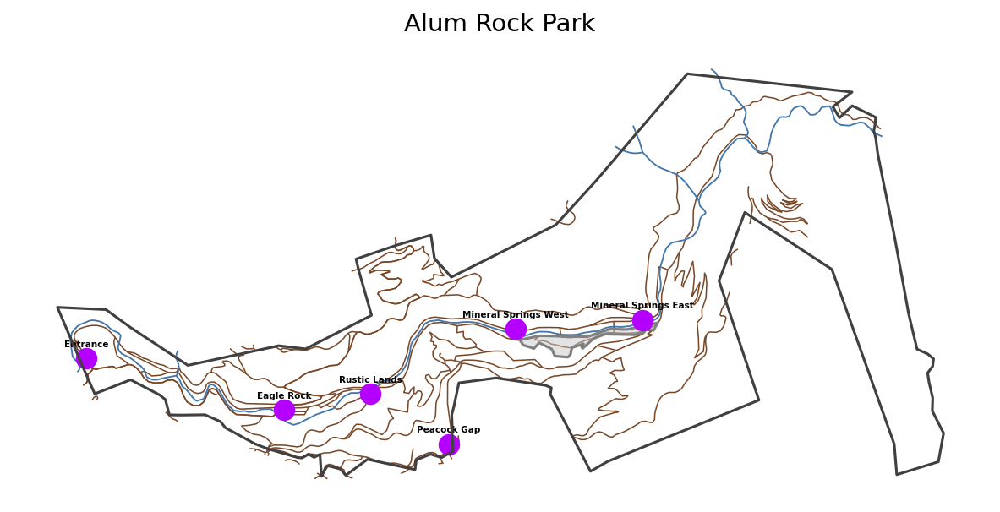
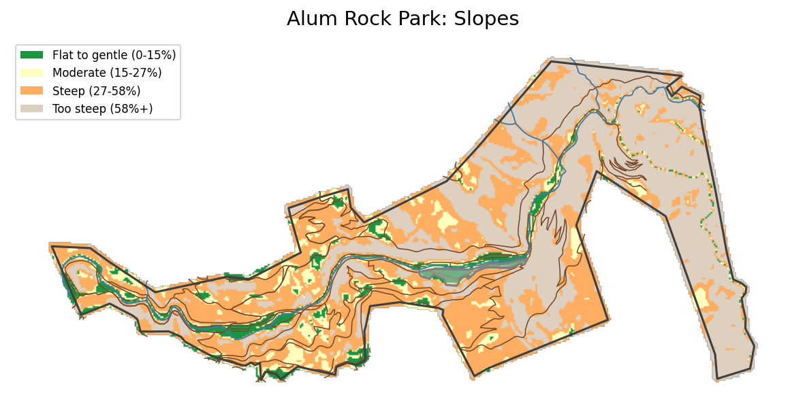
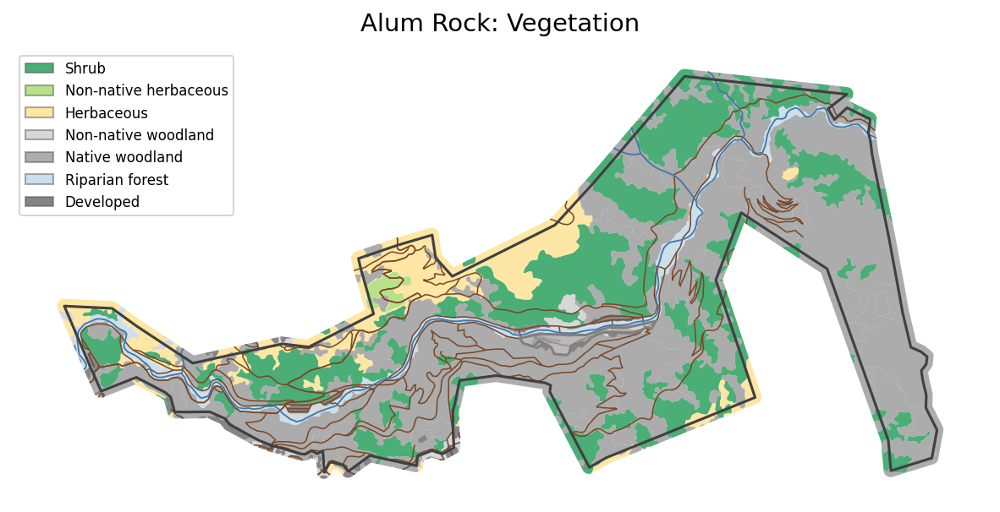
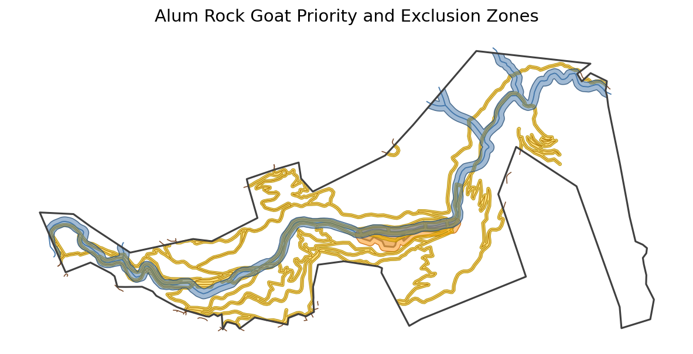
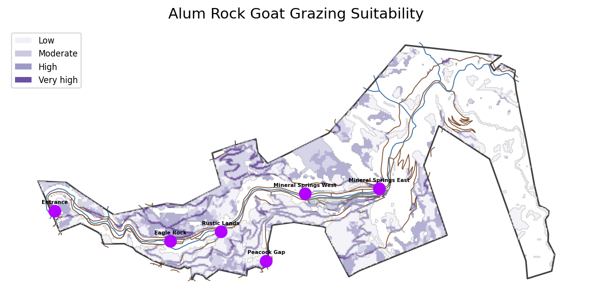
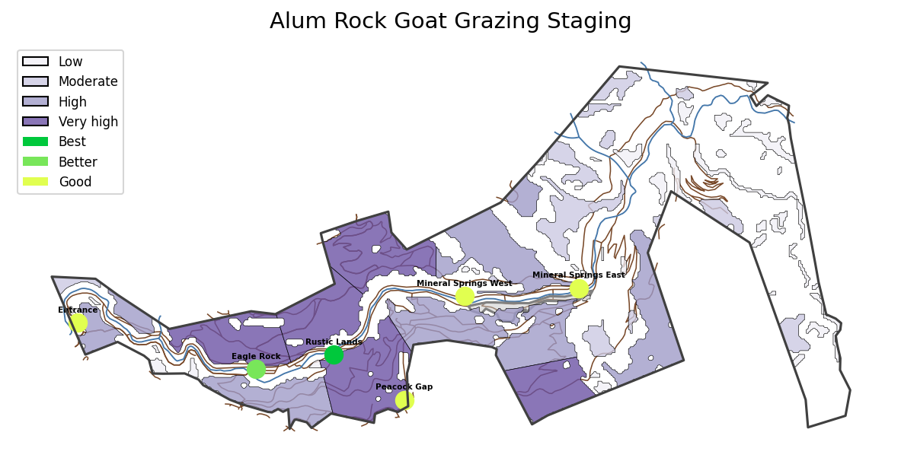
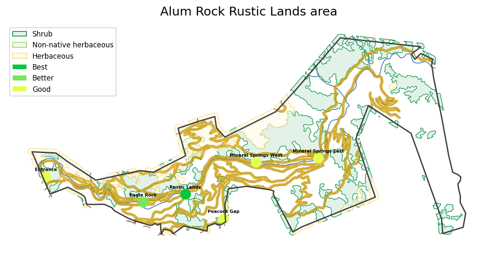

# Goat Grazing Site Selection in Alum Rock Park
### A Geospatial Analysis for Fire Hazard Reduction

## The Problem

Alum Rock Park is a 720-acre open space in the Diablo Range foothills of east San José. The State Fire Marshal has designated the park and the adjacent Cherry Flat Reservoir as a **high fire hazard zone**, meaning the city bears primary responsibility for fire protection. The park's rugged terrain, dense shrublands, and proximity to residential neighborhoods make uncontrolled wildfire a serious public safety risk.

The City's [Vegetation Management Plan](https://www.sanjoseca.gov/home/ showpublisheddocument/122618/639118513447970000)
recommends targeted fuel reduction along roads, trails, and high-use areas. Mowing works on flat ground, but much of the park is too steep for mechanical equipment. Cattle graze at the neighboring Sierra Vista Open Space Reserve, but are not effective at browsing shrubby chaparral common in the park, and cannot access steeper slopes.

Goats are a proven alternative. They go where equipment can't reach, they prefer the shrubby vegetation that poses the greatest fire risk, and they can be deployed in short seasonal engagements using a trailer and portable electric fencing. A herd of a hundred goats can graze an acre a day. This project identifies where in Alum Rock Park goat grazing would be most effective, accounting for terrain, vegetation type, access, and ecological constraints.

---

## The Data

Seven datasets were combined to build this analysis. All data was clipped to the park boundary.

- **Park boundary** (OpenStreetMap) — defines the study area
- **Parking and staging areas** (field-recorded GPS waypoints) — identifies road-accessible goat delivery points
- **Penitencia Creek and waterways** (OpenStreetMap) — source for 100-foot riparian exclusion buffer
- **Roads and trails** (OpenStreetMap) — proximity factor: fuel reduction most impactful near access routes
- **Developed zone** — buildings, picnic areas, parking (GPS track, Strava) — high human-use priority area
- **Digital elevation model** (USGS National Elevation Dataset, 1/3 arc-second, ~10 m) — source of derived terrain slope
- **Fine-scale vegetation map** (Santa Cruz / Santa Clara County) — identifies and classifies plant communities for grazing suitability

---

## Workflow Maps

### The Study Area

Alum Rock Park occupies a narrow east-west canyon in the Diablo Range foothills. Penitencia Creek runs through the canyon floor. The main park road and a network of trails provide access throughout, with parking areas concentrated near the western entrance and at the Rustic Lands trailhead. These parking areas are the candidate *staging areas**: the road-accessible locations where a goat trailer can be parked and animals unloaded for a grazing engagement. Goats must be kept at least 100 feet from the creek and other perennial waterways to protect sensitive streamside vegetation. The developed zone near the middle of the park includes picnic areas, playgrounds, and the  isitor center. This is a high human-use area that benefits from nearby fuel reduction.

### Terrain: Where Can Goats Work?

A digital elevation model (DEM) is a grid of elevation measurements, in this case from USGS satellite data at roughly 10-meter resolution, that can be used to calculate the steepness of terrain at each location. Slope was derived from the USGS DEM and classified into four categories based on OSHA guidelines for riding mower safety, which establish which slopes are too steep for mechanical equipment and therefore most in need of an alternative like goat grazing:

- **0–15% (flat to gentle)** — accessible for mechanical mowing
- **15–27% (moderate)** — accessible for mechanical mowing
- **27–58% (steep)** — too steep for mowing; goats most useful here
- **58%+ (very steep)** — too steep for goats

Slopes above 58% are excluded from consideration entirely. These slopes too steep even for goats to graze safely or for handlers to set up portable fencing. The map shows that the canyon floor and lower hillsides are manageable; much of the remote eastern part of the park is too steep for goats.

### Vegetation: What Are the Targets?

The [Santa Cruz/Santa Clara fine-scale vegetation map](https://tukmangeospatial.egnyte.com/dl/DvNTI67dWG)
classifies the park's plant communities into 121 species-level categories, as well as a lifeform field that describes the general growth form of the dominant plant (shrub, tree, herbaceous, etc.). This analysis rolls up the lifeform values into six groups relevant to fire behavior and grazing suitability. The six groups used, plus developed land, are:

- **Shrublands and chaparral** — Dense woody shrubs such as coyote brush, chamise, and
  toyon. These carry fire quickly, are difficult to mow, and are the goats' preferred food. Highest grazing priority.
- **Non-native herbaceous** — Annual grasses and weedy forbs; also browsed by goats.
  High priority, especially where adjacent to shrubland.
- **Native herbaceous / grassland** — Seasonal grasslands; a grazing priority, though lower   than shrubland where fuel loads are highest.
- **Oak woodland** — Mixed oak canopy limits ladder fuels without grazing; lower priority.
- **Riparian forest** — Streamside woodland along Penitencia Creek. Excluded from grazing   entirely to protect this sensitive habitat.
- **Developed** — Buildings, pavement, and infrastructure; not relevant for grazing.

### Constraints and Priority Zones

Before scoring candidate areas, two types of spatial rules were applied:

**Exclusion zones** remove areas from consideration entirely:
- A 100-foot buffer around Penitencia Creek and all other waterways protects sensitive
riparian vegetation. Goats browse everything within reach; without this setback, streamside plant communities could be damaged.
- Slopes exceeding 58% are excluded as inaccessible to goats.
- The developed zone consisting of buildings and paved surfaces is excluded.

**Priority zones** increase the value of areas that deliver the greatest fire safety benefit:
- A 30-foot buffer along roads and trails. As the Vegetation Management Plan states, fuel reduction is "most impactful along roads, wide trails, and high human use areas, where annual maintenance of shoulders and defensible space can mitigate against the start and spread of fire and maintain safe access and egress."
- A 100-foot buffer around the developed zone, where reducing fuel loads near picnic areas and playgrounds directly protects public safety.

---

## Results

### Combined Suitability

Each location in the park was scored by combining four factors into a single suitability
score. Each factor carries equal weight:

- **Slope (25%)** — steeper terrain scores higher, since those slopes can't be mowed
- **Vegetation type (25%)** — shrubland and chaparral score highest
- **Distance to roads and trails (25%)** — within 30 feet of an access route scores higher
- **Distance to developed zone (25%)** — within 100 feet of a high-use area scores higher

Any location in an exclusion zone (riparian buffer, very steep slopes, or developed land) is zeroed out regardless of other scores. The result is a continuous surface where darker purple indicates the highest-priority locations for fuel reduction. High-value areas concentrate in the central and western portions of the park, where shrubland vegetation meets the main trail network on accessible slopes.

### Recommended Grazing Zones Overview

The suitability data was converted into discrete grazing zones by grouping adjacent high-suitability areas, smoothing edges, and filtering out patches smaller than about half an acre (too small to be practical for a deployment). Large, sprawling patches were split at natural terrain gaps to match the footprint of a single engagement targeting roughly 30 acres. Riparian buffers were subtracted from all patches as a final step.

Each zone was scored using a compactness metric: compact, high-suitability zones score higher than elongated strips of the same area, then assigned to its nearest staging area. Staging areas are ranked by the total weighted access to high-scoring patches within their cluster. The western staging area near the Rustic Lands trailhead ranks first, with a large cluster of accessible shrubland directly adjacent to the main trail corridor.

### Detail: Rustic Lands Priority Zone

This close-up view shows the area around Rustic Lands, the highest-ranked staging area. This staging area provides access to a contiguous band of shrubland immediately north and south of the main trail, stretching from the park entrance toward the Rustic Lands picnic area. This location satisfies all priority criteria: accessible staging, shrubby vegetation, manageable slopes, and direct adjacency to the main access road and trail corridor. This is the combination the Vegetation Management Plan identifies as highest-impact for fuel reduction.

---

## Results Summary and Recommendations

The geospatial analysis identified discrete goat grazing zones totaling approximately 85 acres within Alum Rock Park. These zones cover roughly 12% of the park area and are concentrated in the central and western sections where shrubland fuel loads are highest and terrain is accessible. All recommended zones respect the 100-foot riparian setback  along Penitencia Creek and exclude slopes above 58%.

The analysis recommends prioritizing the Rustic Lands staging area for the first deployment. This cluster contains the largest contiguous area of high-suitability shrubland, is directly accessible from the existing parking area, and lies immediately adjacent to the main park road and primary trail, where annual fuel reduction is most  needed. A one-week engagement treating approximately 20–30 acres here would reduce fire danger in the immediate defensible space corridor serving the park's popular trails and picnic areas.

For subsequent deployments, the analysis recommends rotating east along the main trail corridor, treating the next-ranked cluster near the Eagle Rock staging area. A phased multi-year program covering all identified zones would systematically reduce fuel continuity across the park's primary human-use corridor while keeping goat operations efficient and cost-effective through short, well-defined engagements from fixed staging points.

---

## Further Study

This analysis used a 10-meter DEM, which smooths over micro-terrain features such as rock outcrops and drainage channels that can affect both goat accessibility and handler safety. A higher-resolution lidar-derived DEM could improve slope accuracy and reduce the risk of overestimating accessible area on complex terrain. 

The analysis also used simplified distance thresholds for staging access; refining these with actual herd size, contractor engagement parameters, and field-verified  fencing anchor points would sharpen the deployment cluster boundaries. 

Most importantly, every site has terrain, vegetation, and access conditions that can only be fully evaluated in person: a site visit by the goat contractor is an essential next step before any deployment is planned. 

---

## References

- [Alum Rock Park Vegetation Management Plan](https://www.sanjoseca.gov/home/showpublisheddocument/122618/639118513447970000) — City of San José
- [Alum Rock Park](https://www.sanjoseca.gov/Home/Components/FacilityDirectory/FacilityDirectory/2088/2028) — park information from the City of San José
- [ArcGIS Online Story Map](https://storymaps.arcgis.com/stories/9e0932b441064fc1ade19f39aae61290)
- [GitHub project repo](https://github.com/kielni/alidade/tree/main/projects/goats) - details on datasets, analyses, and Python code
- [Goats on the Go FAQ](https://www.goatsonthego.com/faq) — goat contractor resource on behavior and diet
- [Goats may help prevent wildfires in California](https://www.nationalgeographic.com/animals/article/goats-may-help-prevent-wildfires-in-california) — National Geographic
- [Riding Mower Safety: Slopes](https://www.osha.gov/riding-mowers) — OSHA slope gradient guidelines
- [Santa Cruz and Santa Clara County Fine Scale Vegetation Map](https://tukmangeospatial.egnyte.com/dl/DvNTI67dWG) -  121-class vegetation map of Santa
Cruz and Santa Clara Counties
- [USGS 1/3 Arc Second n38w122 20100929](https://www.sciencebase.gov/catalog/item/6a2776cf1ba49b927058c152) - tile of the 3D Elevation Program (3DEP), the elevation layer of The National Map.
- Goat photo credit: [Martin Vorel](https://martinvorel.com/)
