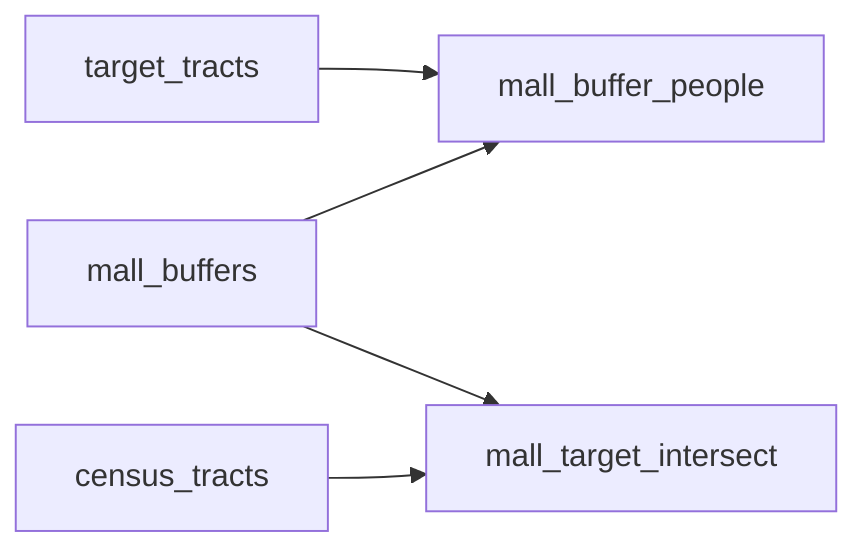

# Lab 4

<!-- auto:begin -->
## Layers

### Big Bucks Malls

**Source:** `output/malls.shp`  
**Style:** single symbol — SVG marker mall.svg, 5.0 MM  
**Processing:** Geocode mall_names.csv addresses with Nominatim; reproject to EPSG:2227. Fields: id, Street, mall_name, city.

### Mall Buffer People

**Source:** `output/mall_buffer_people.shp`  
**Style:** rule-based (3 rules)  
**Derived from:** `target_tracts`, `mall_buffers`  
**Processing:** Spatial join target tracts (pct_m22_39 > 20%) with mall 5-mile buffers; sum M22_39 per mall; assign equal-count bucket (0/1/2).

### Mall Target Intersect

**Source:** `output/mall_target_intersect.shp`  
**Style:** graduated (5 classes on `M22_39`)  
**Derived from:** `mall_buffers`, `census_tracts`  
**Processing:** Spatial inner join (intersects) of mall 5-mile buffers with census tracts where pct_m22_39 > 20%; retains Total and M22_39.

### Basemap

**Source:** `CartoDB Positron XYZ tile service`  
**Style:** see `styles/cartodb_dark_matter.xml`  

## Data flow

## Processing tools

| Layer | Tool | Description |
| --- | --- | --- |
| `mall_points` | `geopandas` | Geocode mall_names.csv addresses with Nominatim; reproject to EPSG:2227. Fields: id, Street, mall_name, city. |
| `mall_buffer_people` | `geopandas` | Spatial join target tracts (pct_m22_39 > 20%) with mall 5-mile buffers; sum M22_39 per mall; assign equal-count bucket (0/1/2). |
| `mall_target_intersect` | `geopandas` | Spatial inner join (intersects) of mall 5-mile buffers with census tracts where pct_m22_39 > 20%; retains Total and M22_39. |
<!-- auto:end -->
