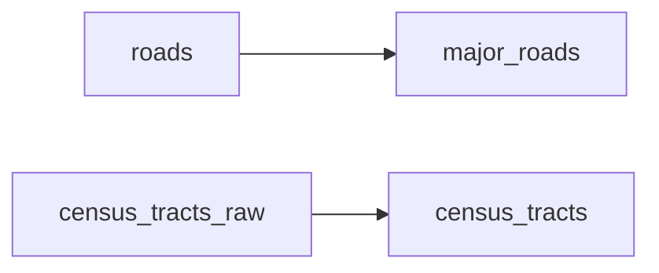

# Lab 4

<!-- auto:begin -->
## Layers

### Shopping Malls

**Source:** `output/malls.shp`  
**Style:** single symbol — SVG marker mall.svg, 5.0 MM  
**Processing:** Geocode malls.csv addresses with Nominatim; reproject to EPSG:2227.

### Major Roads

**Source:** `output/major_roads.shp`  
**Style:** single symbol — solid line #dcd2b4, 0.6 MM  
**Derived from:** `roads`  
**Processing:** Filter roads to primary/major highway FCC codes A10–A21.

### Census Tracts

**Source:** `output/census_tracts.shp`  
**Style:** graduated (5 classes on `M22_39`)  
**Derived from:** `census_tracts_raw`  
**Processing:** Filter census tracts to those with Total > 0.

### Basemap

**Source:** `CartoDB Positron XYZ tile service`  
**Style:** see `styles/cartodb_positron.xml`  

## Data flow

## Processing tools

| Layer | Tool | Description |
| --- | --- | --- |
| `malls_c4ae8970` | `geopandas` | Geocode malls.csv addresses with Nominatim; reproject to EPSG:2227. |
| `major_roads` | `geopandas` | Filter roads to primary/major highway FCC codes A10–A21. |
| `census_tracts` | `geopandas` | Filter census tracts to those with Total > 0. |
<!-- auto:end -->
