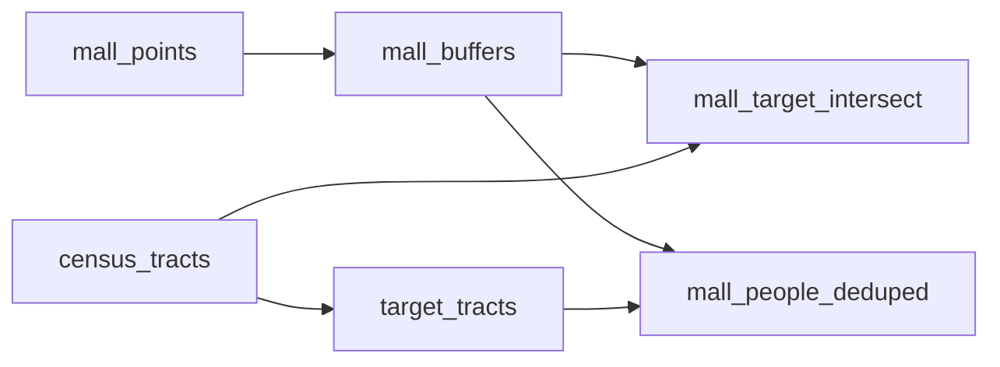

# Lab 4

<!-- auto:begin -->
## Layers

### Big Bucks Malls

**Source:** `output/malls.shp`  
**Style:** single symbol — SVG marker mall.svg, 5.0 MM  
**Processing:** Geocode mall_names.csv addresses with Nominatim; reproject to EPSG:2227. Fields: id, Street, mall_name, city.

### Mall 5-Mile Buffers

**Source:** `output/mall_buffers.shp`  
**Style:** single symbol — fill #90ee90 at 50% opacity, #50a050 outline  
**Derived from:** `mall_points`  
**Processing:** Buffer mall points by 5 miles (26,400 ft) in EPSG:2227

### Target Census Tracts

**Source:** `output/target_tracts.shp`  
**Style:** rule-based (5 rules)  
**Derived from:** `census_tracts`  
**Processing:** Calculate pct_m22_39 = M22_39 / Total * 100; keep tracts where pct_m22_39 > 20.

### Mall Target Intersect

**Source:** `output/mall_target_intersect.shp`  
**Style:** graduated (5 classes on `M22_39`)  
**Derived from:** `mall_buffers`, `census_tracts`  
**Processing:** Spatial inner join (intersects) of mall 5-mile buffers with census tracts where pct_m22_39 > 20%; retains Total and M22_39.

### Mall Draw Zones

**Source:** `output/mall_people_deduped.shp`  
**Style:** rule-based (3 rules)  
**Derived from:** `mall_buffers`, `target_tracts`  
**Processing:** Build Voronoi draw zones (Voronoi cell ∩ 5-mile buffer) for each mall; area-weight M22_39 from target tracts across zone boundaries; assign equal-count bucket (0/1/2).

### Basemap

**Source:** `CartoDB Dark Matter XYZ tile service`  
**Style:** see `styles/cartodb_dark_matter.xml`  

## Data flow

## Processing tools

| Layer | Tool | Description |
| --- | --- | --- |
| `mall_points` | `geopandas` | Geocode mall_names.csv addresses with Nominatim; reproject to EPSG:2227. Fields: id, Street, mall_name, city. |
| `mall_buffers` | `geopandas` | Buffer mall points by 5 miles (26,400 ft) in EPSG:2227 |
| `target_tracts` | `geopandas` | Calculate pct_m22_39 = M22_39 / Total * 100; keep tracts where pct_m22_39 > 20. |
| `mall_target_intersect` | `geopandas` | Spatial inner join (intersects) of mall 5-mile buffers with census tracts where pct_m22_39 > 20%; retains Total and M22_39. |
| `mall_people_deduped` | `geopandas` | Build Voronoi draw zones (Voronoi cell ∩ 5-mile buffer) for each mall; area-weight M22_39 from target tracts across zone boundaries; assign equal-count bucket (0/1/2). |
<!-- auto:end -->
