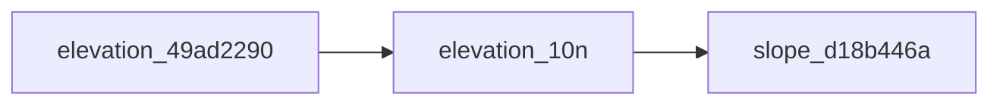

# 

<!-- auto:begin -->
## Data Sources

| File | Description | Origin |
|---|---|---|
| `data/park_polygon.geojson` | park_polygon |  |
| `data/ARP_areas.geojson` | ARP_areas |  |
| `data/park_features_symbol.geojson` | park_features_symbol |  |
| `CartoDB Positron XYZ tile service` | CartoDB Positron | XYZ / WMS tile service |
| `WMS/XYZ tile service` | ESRI satellite | XYZ / WMS tile service |
| `data/elevation.tif` | elevation-import |  |

## Processing Steps

1. **elevation-10N**
2. **Slope**

## Data Flow

<!-- auto:end -->
